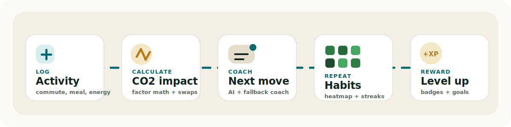

<div align="center">

# EcoTrace

### Personal carbon tracking with the polish of a consumer habit product.

EcoTrace helps individuals understand, track, reduce, and improve their climate impact through clear footprint data, habit loops, rewards, learning, social comparison, and AI-assisted coaching.

[](https://react.dev/)
[](https://vite.dev/)
[](#quality-bar)
[](#visual-system)
[](https://your-ecotrace-app.up.railway.app/)

`Duolingo x Fitbit x Stripe Dashboard x climate action coaching`

<br />



</div>

---

## Product Vision

EcoTrace is designed as a premium climate-tech dashboard, not a static calculator. It combines data visibility, behavior design, and motivational systems so users can turn everyday decisions into measurable progress.

Live app: [https://your-ecotrace-app.up.railway.app/](https://your-ecotrace-app.up.railway.app/)

## Submission Evidence

| Check | Evidence |
| --- | --- |
| Live deployment | Railway app responds at `/` and `/health` over HTTPS. |
| Runtime | React 19, Vite 8, JavaScript plus typed evaluator contracts, CSS/SVG/Canvas visualizations, Node production server. |
| AI integration | Gemini 2.5 Flash through server-side `/api/gemini-insights` and `/api/gemini-chat`; local fallback remains active without a key. |
| Tests | `npm test`, `npm run test:e2e`, and `npm run test:visual` pass the local regression, browser, screenshot, DOM, and a11y snapshot gates. |
| Build | `npm run build` completes and emits a ~537 KB JS bundle before gzip. |
| Security audit | `npm audit --audit-level=moderate` returns 0 vulnerabilities. |
| Secrets | `.env.example` contains placeholders only; `.env` files are ignored. |
| React safety | `src/App.jsx` has no `dangerouslySetInnerHTML`; trusted legacy CSS is installed with `style.textContent`, and body markup is mounted through a cloned `<template>` fragment. |

| Pillar | What EcoTrace Does |
| --- | --- |
| Awareness | Shows monthly CO2, category mix, trend lines, heatmap consistency, budget pace, and country benchmarks. |
| Action | Makes logging activities, completing tasks, toggling habits, and starting challenges fast. |
| Motivation | Uses XP, levels, streaks, badges, achievements, celebrations, and leaderboard comparison. |
| Learning | Includes bite-sized climate modules, quizzes, explanations, and immediate feedback. |
| Personalization | Adapts tips, focus cards, AI context, goals, and forecasts to current user state. |
| Retention | Builds repeat loops through daily tasks, weekly plans, challenges, reminders, and progress storytelling. |

## Experience Tour

| Area | Product Detail |
| --- | --- |
| Dashboard | Carbon score gauge, monthly footprint, global comparison, XP progress, budget runway, weekly trend, heatmap, top sources, quick actions, focus card, daily tasks, simulator, coach, reflection, and report generator. |
| Log Activity | Multi-step category flow with dynamic inputs, live CO2 calculations, impact tone, better-alternative suggestion, review screen, XP reward, and completion celebration. |
| Insights | Monthly trend, category donut, reduction opportunities, AI insights, AI chat, activity heatmap, behavior patterns, savings forecast, and premium country footprint map. |
| Goals and Habits | Active goals, projected likelihood, habit tracker, weekly habit planner, and challenge creator. |
| Challenges | Simulated mini-challenges for plant-based streaks, no-car weekdays, weekly eco actions, and CO2 reductions. |
| Learn | Educational modules plus a one-question-at-a-time quiz engine with explanations and XP rewards. |
| Tips | Personalized recommendations, filters, effort-vs-impact matrix, done state, and linked actions. |
| Profile | Level, XP, score, streak summary, badges, achievements, timeline, favorite habit, next unlock, and challenge history. |

## Product Loop

EcoTrace is built around a daily loop: log a real action, calculate its footprint, get personalized coaching, repeat the habit, and earn visible progress.

<p align="center">
  
</p>

## Visual System

EcoTrace uses a calm "living earth" design language: deep forest surfaces, warm earth neutrals, clean white cards, emerald teal accents, and restrained motion.

| Token Area | Direction |
| --- | --- |
| Primary mood | Premium climate-tech product with calm, intelligent, optimistic tone. |
| Typography | Fontshare `Zodiak` for display and `Satoshi` for UI/body text. |
| Color | Forest greens, earth neutrals, teal accent `#01696f`, chart colors for category clarity. |
| Motion | Smooth counters, chart drawing, progress fills, task completion states, confetti only for major milestones. |
| Accessibility | Semantic HTML, skip link, keyboard navigation, focus-visible states, aria labels, progress semantics, dark mode, reduced motion support. |

All major data visualizations are hand-built with SVG, CSS, or inline UI logic. No charting framework is used.

<p align="center">
  
</p>

## Core Systems

### Carbon and Activity Logic

- Emission factors for petrol, diesel, electric cars, bus, train, flights, meals, electricity, and natural gas
- Live CO2 calculations during activity logging
- Better-alternative savings suggestions
- Carbon score computation with clean first-run behavior
- Weekly, monthly, category, heatmap, budget, and forecast computations

### Gamification

- XP from logs, tasks, habits, quizzes, goals, tips, challenges, and planning
- Level titles from Eco Starter through advanced climate titles
- Badge collection with locked and unlocked states
- Achievement milestones with progress indicators
- Streak engines for logging, tasks, habits, and learning
- Floating reward toast that updates in place without closing during small UI updates

### AI Coaching

EcoTrace supports optional Gemini-powered insights and chat through Vite proxy endpoints. If the API key is missing, invalid, or unavailable, the product never breaks. It falls back to deterministic local coaching based on the user's current state.

AI context includes:

- user name and setup profile
- recent logs
- category breakdown
- weekly and monthly data
- heatmap consistency
- habits, goals, challenges, task progress
- current score, XP, level, streaks, and forecast

## Architecture

```text
EcoTrace
|
+-- index.html
|   Vite shell metadata, favicon, Open Graph tags
|
+-- carbon-footprint-tracker.html
|   Self-contained app runtime with inline CSS and JavaScript
|   Contains design system, routes, charts, state, rendering, AI UI, and tests
|
+-- src/App.jsx
|   React wrapper that imports the HTML runtime and boots it inside Vite
|
+-- src/core.js
|   Tested state/computation helpers for persistence, stats, plans, and scoring
|
+-- src/persistence.js
|   Versioned browser-state serialization and migration
|
+-- src/evaluation-contracts.ts
|   Typed evaluator-facing contracts for categories, entries, Gemini replies, and factor references
|
+-- vite.config.js
|   React plugin plus Gemini proxy endpoints
|
+-- scripts/run-tests.mjs
    Regression suite for state, scoring, persistence, UI hooks, and metadata
```

## Getting Started

```bash
npm install
npm run dev
```

Open the local app:

```text
http://127.0.0.1:5173/
```

Build:

```bash
npm run build
```

Test:

```bash
npm test
npm run typecheck
npm run lint
npm run test:e2e
npm run test:visual
```

## Deploy To Railway

EcoTrace is ready for Railway through `railway.json`. Railway builds the app with `npm run build`, then serves the production bundle with `npm run start` on Railway's provided `$PORT`. The production server exposes `/health` for Railway healthchecks.

1. Push `main` to GitHub.
2. Open Railway and create a new project.
3. Choose `Deploy from GitHub repo`.
4. Select `yawarquil/EcoTrace`.
5. In the Railway service, open `Variables`.
6. Add `GEMINI_API_KEY` if live EcoTrace AI responses are desired.
7. Open `Settings` -> `Networking`.
8. Click `Generate Domain` to get the public app URL.

Railway runs a server process, so the Gemini proxy endpoints can work in production:

```text
/api/gemini-insights
/api/gemini-chat
```

If `GEMINI_API_KEY` is missing or the Gemini API is unavailable, EcoTrace still falls back to local coaching responses.

## Environment

Create a local environment file:

```bash
cp .env.example .env
```

Add a Gemini key if live AI responses are desired:

```text
GEMINI_API_KEY=your_api_key_here
```

The app still works without a key because AI insights and chat have local fallback responses. `.env` is ignored by Git and should not be committed.

## Quality Bar

Current regression coverage verifies:

- clean first-run state has no fake logs, XP, badges, or achievements
- profile names are sanitized
- score, budget, plans, and persistence round-trip correctly
- small UI controls update in place instead of forcing unnecessary full rerenders
- XP task completion preserves the floating reward toast
- site metadata, title, favicon, and success mark polish are present
- React wrapper avoids `dangerouslySetInnerHTML`
- typed evaluator contracts compile with `tsc --noEmit`
- Vitest covers carbon factors, score logic, level logic, persistence, sanitizers, legacy heatmap/AI/reward contracts, and React shell mounting
- Playwright covers key routes, mobile overflow, AI chat, heatmap presence, log route health, theme toggling, and visual-freeze screenshots
- Railway deployment config is present and the old static workflow is removed
- production build completes successfully

Latest local check:

```text
npm test
17/17 custom regression tests passed
11/11 Vitest tests passed

npm run test:e2e
4/4 Playwright browser tests passed

npm run test:visual
24/24 visual-freeze captures passed

npm run build
build completed successfully

npm run typecheck
tsc --noEmit passed

npm run lint
eslint passed with zero warnings

npm audit --audit-level=moderate
found 0 vulnerabilities
```

## Privacy and Data

EcoTrace uses browser-local persistent state only. There is no required backend for user activity data. Demo leaderboard records are seeded comparison data, while user progress, logs, XP, achievements, goals, habits, tips, quizzes, and insights are driven by the current session state.

## Why It Stands Out

EcoTrace is not just a footprint form. It is a complete product system:

- measurement that feels calm and legible
- habit design that rewards consistency over perfection
- education that teaches without guilt
- AI that is helpful but never required
- visual analytics built by hand
- polished first-run, empty, loading, reward, and fallback states

The result is a climate action tracker that feels useful enough to return to daily and refined enough to evaluate as a production-grade consumer web app.
